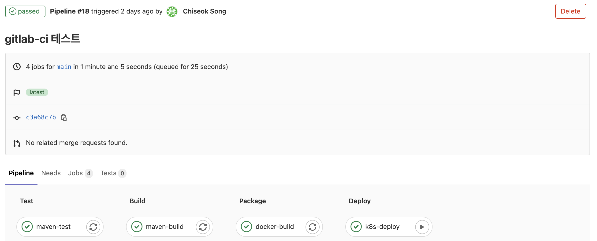
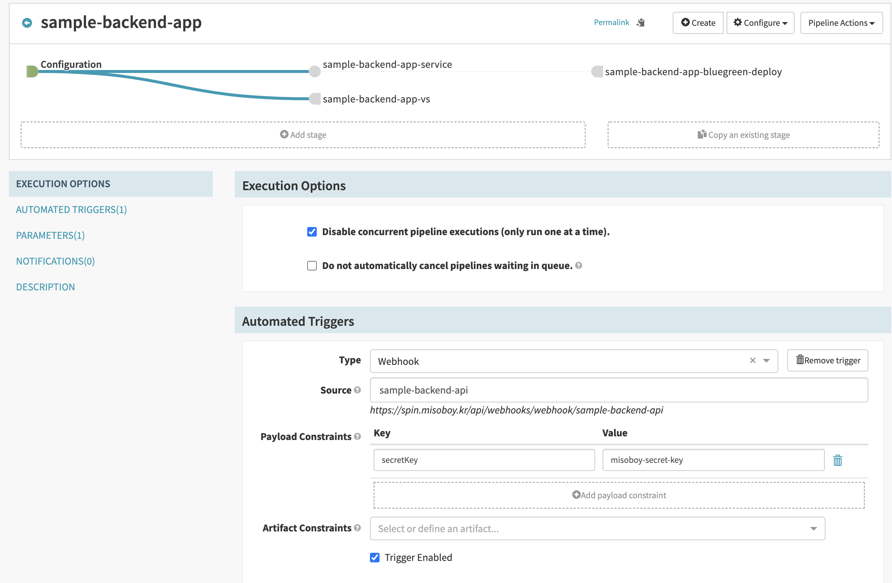
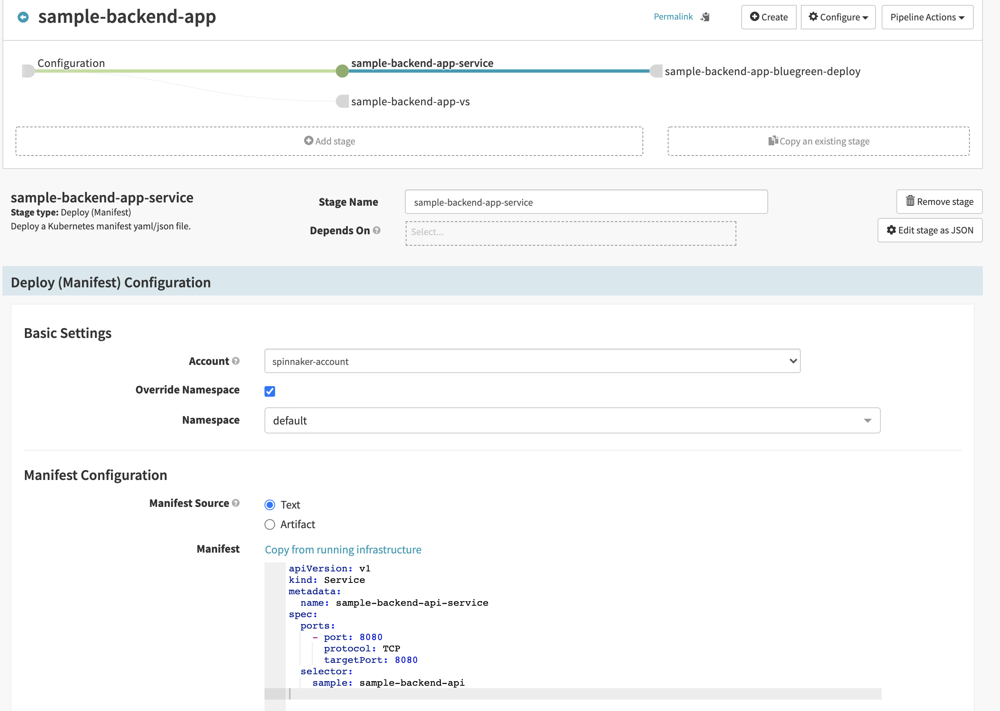
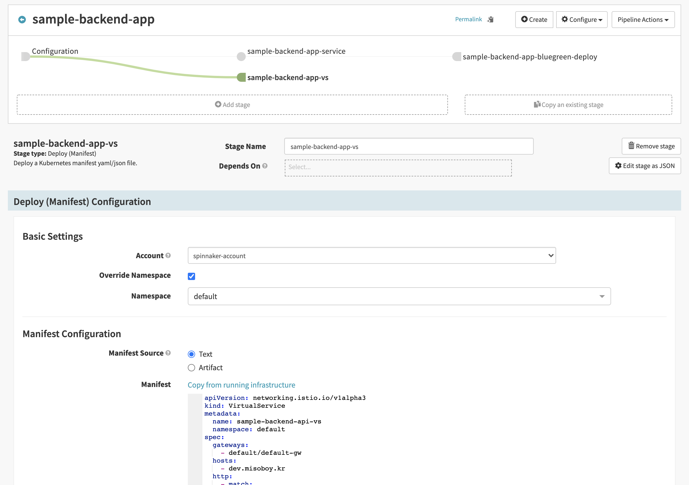
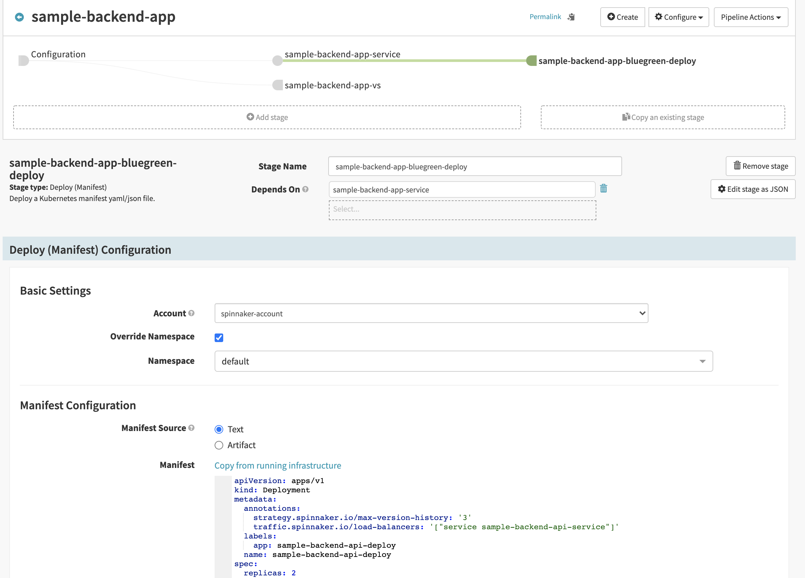

# Demo API App

### Git Clone
```bash
$ git clone https://github.com/bsp-dx/sample-backend-app.git
```
### Maven Build
```bash
$ ./mvnw clean package -DskipTests
```

### Docker build
```bash
$ docker build -t harbor.devapp.shop/sample-backend/sample-api-app:1.0.20210405 -f ./docker/Dockerfile .
```

### Docker Push
```bash
$ docker push harbor.devapp.shop/sample-backend/sample-api-app:1.0.20210405
```

### Docker Run
```bash
$ docker run -d -p 8080:8080 sample-api-app:1.0.20210405
```

### Swagger UI
```bash
http://localhost:8080/swagger-ui.html
```

### Rest API
1. 사용자 목록 조회
```bash
# Request 
curl -XGET http://localhost:8080/api/v1/user/

# Response 
[
  {
    "emplyrId": "00000000000000000001",
    "emplyrNm": "심선보",
    "email": "seonbo.shim@bespinglobal.com",
    "deptNm": "DX팀",
    "rankNm": "팀장",
    "password": "password",
    "useAt": "Y",
    "registDt": 1619569569647,
    "updtDt": null
  },
  {
    "emplyrId": "00000000000000000002",
    "emplyrNm": "김영근",
    "email": "youngkeun.kim@bespinglobal.com",
    "deptNm": "DX팀",
    "rankNm": "매니저",
    "password": "password",
    "useAt": "Y",
    "registDt": 1619569569653,
    "updtDt": null
  },
  {
    "emplyrId": "00000000000000000003",
    "emplyrNm": "송치석",
    "email": "chiseok.song@bespinglobal.com",
    "deptNm": "DX팀",
    "rankNm": "매니저",
    "password": "password",
    "useAt": "Y",
    "registDt": 1619569569653,
    "updtDt": null
  },
  {
    "emplyrId": "00000000000000000004",
    "emplyrNm": "이현복",
    "email": "hyunbok.lee@bespinglobal.com",
    "deptNm": "DX팀",
    "rankNm": "매니저",
    "password": "password",
    "useAt": "Y",
    "registDt": 1619569569654,
    "updtDt": null
  }
]
```

2. 사용자 상세 조회
```bash
# Request 
emplyrId : 00000000000000000001

curl -XGET http://localhost:8080/api/v1/user/{emplyrId}

# Response 
{
  "emplyrId": "00000000000000000001",
  "emplyrNm": "심선보",
  "email": "seonbo.shim@bespinglobal.com",
  "deptNm": "DX팀",
  "rankNm": "팀장",
  "password": "password",
  "useAt": "Y",
  "registDt": 1619569569647,
  "updtDt": null
}
```

### CI/CD 설정
1. Gitlab runner script 작성 [바로가기](./.gitlab-ci.yml) 
   
2. Spinnaker - Event Trigger Configuration 

3. Spinnaker - Sample Back-end Service 설정 

4. Spinnaker - Sample Back-end Virtual Service 설정 

5. Spinnaker - Sample Back-end Deployment 설정 
